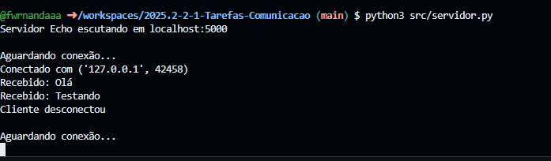
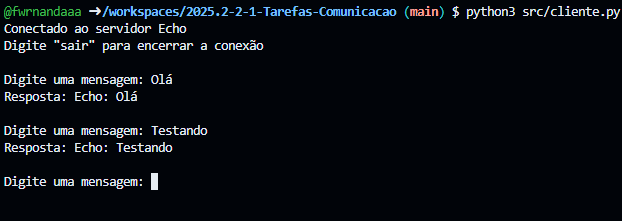
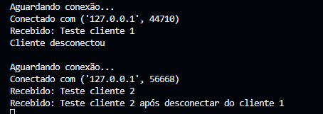
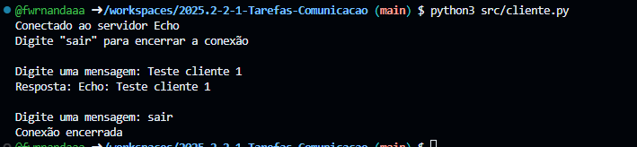
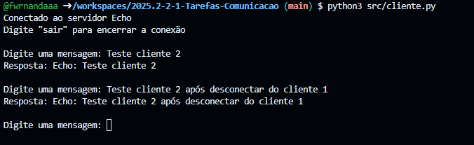
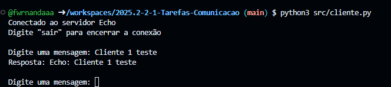

# Relato da atividade de comunicação entre processo usando sockets

## Informações gerais
- **disciplina**: Sistemas operacionais
- **semestre letivo**: 2025.2
- **aluna**: Fernanda Dantas do Nascimento

## Parte 1 — 1 servidor e 1 cliente (bloqueante)
### Perspectiva do servidor

O servidor inicia normalmente e fica aguardando uma conexão.  
Ao executar o cliente, o servidor recebe a mensagem enviada pelo cliente e exibe no terminal.  
Quando o cliente conecta, o servidor recebe a mensagem e imprime no terminal. Quando o cliente desconecta, o servidor volta ao estado de "Aguardando conexão".

### Perspectiva do cliente

O cliente conecta ao servidor, envia uma mensagem e recebe de volta exatamente o mesmo conteúdo (servidor Echo).  

## Parte 2 — 1 servidor e 2 clientes (bloqueante)
### Perspectiva do servidor

### Perspectiva do cliente 1

### Perspectiva do cliente 2

O servidor aceita apenas um cliente por vez, pois o modelo é totalmente bloqueante.  
O cliente 1, que iniciou primeiro, conseguiu estabelecer a conexão e realizar a troca de mensagens normalmente. Já o cliente 2 ficou aguardando, sem resposta, até que o cliente 1 finalizasse sua comunicação.  
Somente após o encerramento da conexão do cliente 1 é que o servidor pôde atender o cliente 2.  
Isso evidencia que o servidor é estritamente sequencial: ele só processa um cliente por vez e todos os outros ficam bloqueados na tentativa de conexão.

### Perguntas para relatório:

- O segundo cliente bloqueou? Por quanto tempo? Houve recusa imediata?

O segundo cliente não recebeu recusa imediata, mas também não foi atendido enquanto o primeiro cliente estava conectado.
Ele ficou bloqueado na fila, aguardando o servidor liberar o accept() após o cliente 1 encerrar sua conexão.
- O servidor atende estritamente em série? O que evidencia isso?

Sim, o servidor atende estritamente em série. A evidência é que o servidor só processou o cliente 2 depois que o cliente 1 finalizou toda sua troca de mensagens.

## Parte 3 — Modificar o servidor para múltiplos clientes
### Perspectiva do servidor

### Perspectiva do cliente 1

### Perspectiva do cliente 2

Ambos os clientes conseguem se conectar e interagir com o servidor ao mesmo tempo. Mesmo que um cliente esteja enviando várias mensagens, o outro não precisa aguardar.

## Conclusão

No início, o servidor funcionava de maneira totalmente bloqueante, atendendo apenas um cliente por vez. Esse modelo mostrou suas limitações rapidamente, já que qualquer novo cliente precisava aguardar a finalização completa do anterior para conseguir ser atendido.

Após a modificação da Parte 3, utilizando threads, o servidor passou a operar de forma concorrente. Cada conexão passou a ser tratada em uma thread independente, permitindo que o accept() continuasse ativo e aberto para novas conexões. O teste da Parte 3 confirmou esse funcionamento: dois clientes puderam se conectar quase ao mesmo tempo, enviar mensagens e receber respostas sem bloquear um ao outro.

